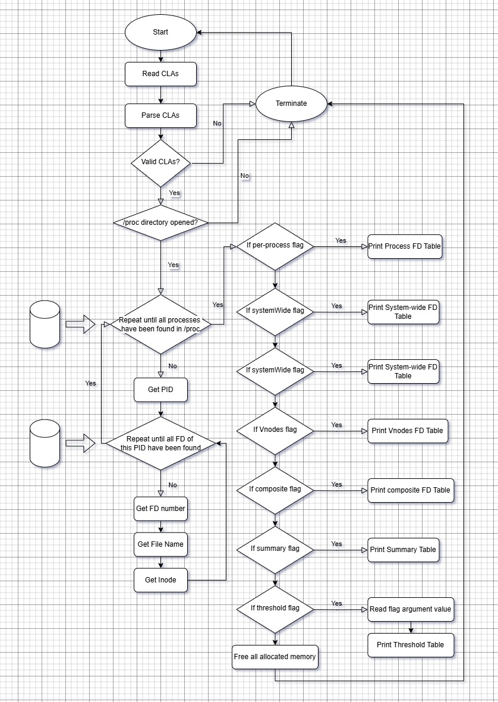

TITLE -- Assignment 2: Recreating the System-Wide FD Tables

1.  Metadata
    Author: Kobe Chui
    Date: March 8, 2025

2.  Introduction
    This project attempts to recreate the system-wide FD tables which include corresponding information such as PID, FD numbers, file names and inodes from each process.

3.  How I solved the problem
    -   I solved the problem with extensive researching. Understanding all the suggested libraries and relevant functions and generated a draft of plan.
    -   I also utilized my understanding in file descriptors, inode, processes, etc. for this project.
    -   I first took care of the command line parsing. From the last assignment I realized that parsing and error checking takes up a lot of lines of code,
        so I decided to have showFDtables.c with a main function as a driver, and a separate parse_command_line.c along with parse_command_line.h to link both showFDtables.c and parse_command_line.c together.
        I decided to use getopt_long() with the struct option provided by <getopt.h> to parse arguments and check their validity, then store indicated flags in a struct flags. 
    -   Then I focused on how processes and file descriptors can be stored, separating data storing functions in process_cdt.c and information processing functions in process_info.c along with process.h
        Since it is generally slow to operate on OS files, I decided to obtain all necessary directories and files and store all the related information into two different structs in described in process.h.
        One is a struct of process information, the other is a struct of file discriptor information. Linked lists are used to store each of them. 
        Collecting information of both processes and file descriptors has similar ways. I open the directories for each accessible process, open directories from each process, then retrieve FD number, file name and inode.
        I used libraries including <limits.h>, <unistd.h>, <sys/stat.h>, <dirent.h>, and <string.h>.
    -   Lastly, I created another file table_display.c and table_display.h to print all tables according to provided flags and specified PIDs. 

4.  Implementation
    My code is separated into 4 main parts: the driver program - showFDtables.c, the command line parser - parse_command_line.c, process related programs - process_info.c and process_cdt.c and lastly tables printing program - table_display.c
    Header files are used to connect them, that is parse_command_line.h, process.h, and table_display.h respectively.
    showFDtables.c is a driver programs that uses functions in parse_command_line.h to parse and save command line arguments, retrieves all accessible process information from the OS using functions from process.h, and prints the FD tables which the user specifies with flags in the command line using the functions in table_display.

    parse_command_line.h contains the struct flags which stores all the possible flags for this assignment, inlcuding --per-process, --systemWide, --Vnodes, --composite, --summary, and --threshold which requires a integer argument.
    parse_command_line.c contains the logic to parse and store the command line arguments. In particular I used getopt_long() with the struct option provided by <getopt.h> which makes reading options more convenient.
    I first checked the position of positional arguments, as it must be located before any flags appear. Then for the threshold flag, since it takes an argument, the argument must be thoroughly checked and it must be a non-negative integer. Lastly, every flag indicated is saved and I checked the validity of the positional argument which represents a specific PID.

    ```c
    //Defined a data type flags to store all the indicated flags and arguments
    typedef struct Flags{
        int pid;
        int process;
        int system_wide;
        int vnodes;
        int composite;
        int summary;
        int threshold;
    }flags;

    //Uses <getopt.h> to parse arguments. Also checked validity of arguments, inlcuding positional arguments.
    void parse_arguments(flags* flag, int argc, char** argv);
    ```

    process.h contains the two structs that I create and each of which specifically store: 
    a. the information of a certain process with its unique PID, its file descriptors (FDs) and the number of FDs for that process. 
    b. the information of a certain file descriptor with its FD number, its file name, and its inode. 
    Both data types are stored in the form of linked lists.
    Anything related to how process and FD information are stored is located in process_cdt.c which includes creating a new process struct, creating a new FD struct, and freeing the memory that was dynamically allocated for the structs mentioned. 
    Anything related to how process and FD information are retrieved is located in process_info.c, which only contains a function that collects informaiton of a process, and a function that collects information of a FD from a PID.
    In process_info.c, funcitons from <dirent.h> were used to open, close and read directories. lstat() from <sys/stat.h> to initialize a struct such that inode information could be retrieved regardless it was a soft or hard link. 
    readlink() from <unistd.h> was used to read the content of the path specified by a certain PID regardless it was a soft or hard link.
    Both process_info.c and process_cdt.c use a macro PATH_MAX from <linux/limits.h> to initialize variables that store file names, which could be very long.
    I researched about efficient ways to convert integers into strings and snprintf() turns out to be the most useful for concatenating file directories with PIDs.
    _GNU_SOURCE was defined in process_info.c for readlink(), all credits to post @185 on Piazza. 

    ```c
    //Defined a data type to store FD information, including fd number, file name, inode and connected in the form of linked list.
    typedef struct FD_Entry_Struct{
        int fd;
        char file_name[PATH_MAX];
        ino_t inode;
        struct FD_Entry_Struct* next;
    } FD_Entry;

    //Defined a data type to store process information, including PID, its FDs, number of FDs and connected in the form of linked list.
    typedef struct Process_Info_Struct{
        pid_t pid;
        FD_Entry* fd_list;
        int fd_size;                     //size of fd_list
        struct Process_Info_Struct* next;
    } Process_Info;

    //Uses malloc to dynamically allocate memory for the Process_Info struct I created, assigned with a unique PID.
    Process_Info* create_new_process(pid_t pid);

    //Uses malloc to dynamically allocate memory for the FD_Entry struct I created, assigned with a FD number, file name, and a inode.
    FD_Entry* create_new_fd(int fd, char* file_name, ino_t inode);

    //Add fd_entry to the end of linked list fd_list in process.
    int add_fd_to_process(FD_Entry* fd_entry, Process_Info* process);

    //Free all memory that malloc allocated in root.
    void free_process_info(Process_Info* root);

    //Uses <dirent.h> were used to open, close and read directories
    //Uses lstat() from <sys/stat.h> to initialize a struct such that inode information could be retrieved regardless it was a soft or hard link. 
    //Uses readlink() from <unistd.h> was used to read the content of the path specified by a certain PID regardless it was a soft or hard link.
    //Collects all FD information corresponding to the specific PID pid and join them into a Process_Info struct and return it.
    Process_Info* collect_fd(pid_t pid);

    //Uses <dirent.h> were used to open, close and read directories
    //Look through each available PID, call collect_fd to gather each PID's FD information, then join them all into a linked list, and returned. 
    Process_Info* collect_process();
    ```

    table_display.h contains all function prototypes in table_display.c. The main purpose of this file is only to print FD tables according to any specified PID.
    Using the padding property in printf() (e.g. printf("%-10 text") prints left aligned text with at least 10 characters of space), I was able to format the tables when printing onto the shell. 
    For clarity, I added row numbers if no PID was specified in the command line so that PIDs, FDs, inodes, etc. can be referenced from different tables. 
    Note that --threshold=n gives PIDs with number of FDs that are strictly greater than n, so anything equals n will not be printed.

    ```c
    //Prints the per-process table as described in the assignment outline
    //Using information from process and prints table according to the pid specified, in this case it is renamed to has_row_num.
    void print_per_process(Process_Info* process, int has_row_num);

    //Prints the systemWide table as described in the assignment outline
    //Using information from process and prints table according to the pid specified, in this case it is renamed to has_row_num.
    void print_system_wide(Process_Info* process, int has_row_num);

    //Prints the Vnodes table as described in the assignment outline
    //Using information from process and prints table according to the pid specified, in this case it is renamed to has_row_num.
    void print_vnode(Process_Info* process, int has_row_num);

    //Prints the composite table as described in the assignment outline
    //Using information from process and prints table according to the pid specified, in this case it is renamed to has_row_num.
    void print_composite(Process_Info* process, int has_row_num);

    //Prints the summary table as described in the assignment outline
    //Using information from process and prints table according to the pid specified, in this case it is renamed to has_row_num.
    void print_summary(Process_Info* process);

    //Prints the threshold table as described in the assignment outline
    //Using information from process and prints table according to the pid specified, in this case it is renamed to has_row_num.
    void print_threshold(Process_Info* process, int threshold);
    ```

5.  Flow chart
    

6.  Instructions to compile my code
    $ make

    Run "$ make help" to see documentations
    Run "$ make clean" to remove all object files and executables
    The makefile compiles all files with compiler "gcc", warning flags "-Wall -Werror", debugger flag "-g", and standard library flag "-std=c99"
    It generates object files: showFDtables.o, process_info.o, process_cdt.o, parse_command_line.o, and table_display.o
    Then link the above object files and generate the executable "showFDtables"

    Please run the executables with the following CLA syntax: ./showFDtables [pid] [--per-process] [--systemWide] [--Vnodes] [--composite] [--summary] [threshold=n]
    Where [pid] is the positional argument that must appear before any flags. It should be an integer which goes the same with n in [threshold=n].

7.  Expected results
$ ./showFDtables --per-process
        PID        FD
      =================
 1      58527      0
 2      58527      1
 3      58527      2
 4      58527      3
 5      58527      4
 6      58527      5
 7      58527      6
 8      58527      7
 9      58527      8
 10     58527      9
 11     58527      10
 12     58527      11
 13     58527      12
 14     58527      13
 15     58527      14
 16     58527      15
 17     58527      16
 18     58527      17
 19     58527      18
 20     58527      19
 21     58527      20
 22     58527      21
 23     58527      22
 24     58527      23
 25     58527      24
 26     58527      29
 27     58527      30
 28     58527      31
 29     58527      32
 30     58527      33
 31     58527      34
 32     58527      35
 33     58527      36
 34     58527      37
 35     58527      38
 36     58527      39
 37     58527      40
 38     58527      41
 39     58527      42
 40     58527      43
 41     58527      44
 42     58527      45
 43     58527      46
 44     58527      47
 45     58527      48
 46     58527      49
 47     58527      50
 48     58527      51
 49     58527      52
 50     58527      53
 51     58527      54
 52     58544      0
 53     58544      1
 54     58544      2
 55     58544      3
 56     58544      4
 57     58544      5
 58     58544      6
 59     58544      7
 60     58544      8
 61     58544      9
 62     58544      10
 63     58544      11
 64     58544      12
 65     58544      13
 66     58544      14
 67     58544      15
 68     58544      16
 69     58544      17
 70     58544      18
 71     58544      19
 72     58544      20
 73     58544      21
 74     58544      22
 75     58544      23
 76     58544      24
 77     58544      25
 78     58544      26
 79     58544      27
 80     58544      28
 81     58544      29
 82     58544      30
 83     58544      31
 84     58544      32
 85     58544      33
 86     58544      34
 87     58544      35
 88     58544      36
 89     58544      37
 90     58544      38
 91     58544      39
 92     58544      40
 93     58544      41
 94     58544      42
 95     58544      43
 96     58544      44
 97     58546      0
 98     58546      1
 99     58546      2
 100    58546      3
 101    58546      4
 102    58546      5
 103    58546      6
 104    58546      7
 105    58546      8
 106    58546      9
 107    58546      10
 108    58546      11
 109    58546      12
 110    58546      13
 111    58546      14
 112    58546      15
 113    58546      16
 114    58548      0
 115    58548      1
 116    58548      2
 117    58548      3
 118    58548      4
 119    58548      5
 120    58548      6
 121    58548      7
 122    58548      8
 123    58548      9
 124    58548      10
 125    58548      11
 126    58548      12
 127    58548      13
 128    58548      14
 129    58548      15
 130    58548      16
 131    58548      17
 132    58548      18
 133    58548      19
 134    58548      20
 135    58548      21
 136    58548      22
 137    58548      23
 138    58548      24
 139    58548      25
 140    58548      26
 141    58548      27
 142    58548      28
 143    58548      29
 144    58548      30
 145    58548      31
 146    58548      32
 147    58548      33
 148    58548      34
 149    58548      35
 150    58550      0
 151    58550      1
 152    58550      2
 153    58550      3
 154    58550      4
 155    58550      5
 156    58550      6
 157    58550      7
 158    58550      8
 159    58550      9
 160    58550      10
 161    58550      11
 162    58550      12
 163    58550      13
 164    58550      14
 165    58550      15
 166    58550      16
 167    58550      17
 168    58550      18
 169    58550      19
 170    58550      20
 171    58550      21
 172    58550      22
 173    58571      0
 174    58571      1
 175    58571      2
 176    58571      3
 177    58571      4
 178    58571      5
 179    58571      6
 180    58571      7
 181    58571      8
 182    58571      9
 183    58571      10
 184    58571      11
 185    58571      12
 186    58571      13
 187    58676      0
 188    58676      1
 189    58676      2
 190    58676      255
 191    59656      0
 192    59656      1
 193    59656      2
 194    59656      255
 195    59741      0
 196    59741      1
 197    59741      2
 198    59741      3
 199    59741      4

$ .showFDtables --systemWide 
        PID        FD         Filename
      ===================================
 1      58527      0          /dev/null
 2      58527      1          socket:[534871]
 3      58527      2          socket:[534871]
 4      58527      3          socket:[547915]
 5      58527      4          anon_inode:[eventpoll]
 6      58527      5          anon_inode:[signalfd]
 7      58527      6          anon_inode:inotify
 8      58527      7          /sys/fs/cgroup/user.slice/user-26162238.slice/user@26162238.service
 9      58527      8          anon_inode:[timerfd]
 10     58527      9          /usr/lib/systemd/systemd-executor
 11     58527      10         anon_inode:inotify
 12     58527      11         anon_inode:inotify
 13     58527      12         socket:[465706]
 14     58527      13         anon_inode:[eventpoll]
 15     58527      14         /proc/58527/mountinfo
 16     58527      15         anon_inode:inotify
 17     58527      16         /proc/swaps
 18     58527      17         socket:[465689]
 19     58527      18         socket:[465696]
 20     58527      19         socket:[465697]
 21     58527      20         socket:[465698]
 22     58527      21         socket:[465699]
 23     58527      22         socket:[465700]
 24     58527      23         anon_inode:[timerfd]
 25     58527      24         socket:[465701]
 26     58527      29         /sys/fs/cgroup/user.slice/user-26162238.slice/user@26162238.service/init.scope/memory.pressure
 27     58527      30         socket:[550069]
 28     58527      31         anon_inode:[pidfd]
 29     58527      32         socket:[465708]
 30     58527      33         socket:[465710]
 31     58527      34         socket:[465712]
 32     58527      35         socket:[465714]
 33     58527      36         socket:[465716]
 34     58527      37         anon_inode:[pidfd]
 35     58527      38         anon_inode:[pidfd]
 36     58527      39         socket:[550051]
 37     58527      40         socket:[550053]
 38     58527      41         socket:[550055]
 39     58527      42         socket:[550057]
 40     58527      43         socket:[550059]
 41     58527      44         socket:[550061]
 42     58527      45         socket:[550063]
 43     58527      46         socket:[550065]
 44     58527      47         anon_inode:[pidfd]
 45     58527      48         anon_inode:[pidfd]
 46     58527      49         anon_inode:[pidfd]
 47     58527      50         anon_inode:[pidfd]
 48     58527      51         anon_inode:[pidfd]
 49     58527      52         anon_inode:[pidfd]
 50     58527      53         anon_inode:[pidfd]
 51     58527      54         socket:[542358]
 52     58544      0          /dev/null
 53     58544      1          socket:[545035]
 54     58544      2          socket:[545035]
 55     58544      3          socket:[550057]
 56     58544      4          socket:[550059]
 57     58544      5          anon_inode:[eventpoll]
 58     58544      6          anon_inode:[eventfd]
 59     58544      7          anon_inode:[eventfd]
 60     58544      8          anon_inode:[signalfd]
 61     58544      9          anon_inode:[signalfd]
 62     58544      10         anon_inode:[eventpoll]
 63     58544      11         anon_inode:[eventfd]
 64     58544      12         anon_inode:[eventfd]
 65     58544      13         anon_inode:[eventfd]
 66     58544      14         socket:[550986]
 67     58544      15         anon_inode:[eventpoll]
 68     58544      16         anon_inode:[eventfd]
 69     58544      17         anon_inode:[eventfd]
 70     58544      18         anon_inode:[eventfd]
 71     58544      19         /run/user/26162238/pipewire-0.lock
 72     58544      20         anon_inode:[eventfd]
 73     58544      21         /run/user/26162238/pipewire-0-manager.lock
 74     58544      22         anon_inode:[eventfd]
 75     58544      23         anon_inode:[eventfd]
 76     58544      24         anon_inode:[eventfd]
 77     58544      25         socket:[545045]
 78     58544      26         socket:[545045]
 79     58544      27         socket:[545045]
 80     58544      28         socket:[542872]
 81     58544      29         anon_inode:[eventfd]
 82     58544      30         socket:[542869]
 83     58544      31         socket:[542869]
 84     58544      32         socket:[542869]
 85     58544      33         socket:[542873]
 86     58544      34         anon_inode:[timerfd]
 87     58544      35         anon_inode:[eventfd]
 88     58544      36         /memfd:pipewire-memfd:flags=0x0000000f,type=2,size=2312 (deleted)
 89     58544      37         anon_inode:[timerfd]
 90     58544      38         anon_inode:[eventfd]
 91     58544      39         /memfd:pipewire-memfd:flags=0x0000000f,type=2,size=2312 (deleted)
 92     58544      40         anon_inode:[timerfd]
 93     58544      41         anon_inode:[eventfd]
 94     58544      42         /memfd:pipewire-memfd:flags=0x0000000f,type=2,size=2312 (deleted)
 95     58544      43         socket:[533736]
 96     58544      44         socket:[533737]
 97     58546      0          /dev/null
 98     58546      1          socket:[529869]
 99     58546      2          socket:[529869]
 100    58546      3          anon_inode:[eventpoll]
 101    58546      4          anon_inode:[eventfd]
 102    58546      5          anon_inode:[eventfd]
 103    58546      6          anon_inode:[signalfd]
 104    58546      7          anon_inode:[signalfd]
 105    58546      8          anon_inode:[eventpoll]
 106    58546      9          anon_inode:[eventfd]
 107    58546      10         anon_inode:[eventfd]
 108    58546      11         anon_inode:[eventfd]
 109    58546      12         socket:[529876]
 110    58546      13         anon_inode:[eventpoll]
 111    58546      14         anon_inode:[eventfd]
 112    58546      15         anon_inode:[eventfd]
 113    58546      16         anon_inode:[eventfd]
 114    58548      0          /dev/null
 115    58548      1          socket:[495051]
 116    58548      2          socket:[495051]
 117    58548      3          anon_inode:[eventfd]
 118    58548      4          anon_inode:[eventpoll]
 119    58548      5          anon_inode:[eventfd]
 120    58548      6          anon_inode:[eventfd]
 121    58548      7          anon_inode:[eventpoll]
 122    58548      8          anon_inode:[eventfd]
 123    58548      9          anon_inode:[eventfd]
 124    58548      10         anon_inode:[eventfd]
 125    58548      11         socket:[495056]
 126    58548      12         anon_inode:[eventpoll]
 127    58548      13         anon_inode:[eventfd]
 128    58548      14         anon_inode:[eventfd]
 129    58548      15         anon_inode:[eventfd]
 130    58548      16         anon_inode:[eventfd]
 131    58548      17         socket:[542369]
 132    58548      18         anon_inode:[eventpoll]
 133    58548      19         anon_inode:[eventfd]
 134    58548      20         anon_inode:[eventfd]
 135    58548      21         socket:[542370]
 136    58548      22         anon_inode:inotify
 137    58548      23         socket:[531190]
 138    58548      24         anon_inode:[eventfd]
 139    58548      25         anon_inode:inotify
 140    58548      26         socket:[544526]
 141    58548      27         anon_inode:[eventfd]
 142    58548      28         socket:[544527]
 143    58548      29         socket:[544527]
 144    58548      30         socket:[544527]
 145    58548      31         socket:[544529]
 146    58548      32         anon_inode:[timerfd]
 147    58548      33         anon_inode:inotify
 148    58548      34         socket:[544533]
 149    58548      35         anon_inode:inotify
 150    58550      0          /dev/null
 151    58550      1          socket:[533723]
 152    58550      2          socket:[533723]
 153    58550      3          socket:[550055]
 154    58550      4          anon_inode:[eventpoll]
 155    58550      5          anon_inode:[eventfd]
 156    58550      6          anon_inode:[eventfd]
 157    58550      7          anon_inode:[signalfd]
 158    58550      8          anon_inode:[signalfd]
 159    58550      9          anon_inode:[eventpoll]
 160    58550      10         anon_inode:[eventfd]
 161    58550      11         anon_inode:[eventfd]
 162    58550      12         anon_inode:[eventfd]
 163    58550      13         socket:[531174]
 164    58550      14         anon_inode:[eventpoll]
 165    58550      15         anon_inode:[eventfd]
 166    58550      16         anon_inode:[eventfd]
 167    58550      17         anon_inode:[eventfd]
 168    58550      18         anon_inode:[eventfd]
 169    58550      19         socket:[535069]
 170    58550      20         socket:[535069]
 171    58550      21         socket:[535069]
 172    58550      22         socket:[498579]
 173    58571      0          /dev/null
 174    58571      1          socket:[549287]
 175    58571      2          socket:[549287]
 176    58571      3          socket:[465706]
 177    58571      4          anon_inode:[eventpoll]
 178    58571      5          socket:[549300]
 179    58571      6          anon_inode:inotify
 180    58571      7          socket:[549301]
 181    58571      8          socket:[549302]
 182    58571      9          socket:[533728]
 183    58571      10         socket:[533730]
 184    58571      11         socket:[533732]
 185    58571      12         socket:[498607]
 186    58571      13         socket:[549308]
 187    58676      0          /dev/pts/0
 188    58676      1          /dev/pts/0
 189    58676      2          /dev/pts/0
 190    58676      255        /dev/pts/0
 191    59656      0          /dev/pts/1
 192    59656      1          /dev/pts/1
 193    59656      2          /dev/pts/1
 194    59656      255        /dev/pts/1
 195    60196      0          /dev/pts/1
 196    60196      1          /dev/pts/1
 197    60196      2          /dev/pts/1
 198    60196      3          /proc
 199    60196      4          /proc/60196/fd

$ ./showFDtables --Vnodes
        FD         Inode
      ====================
 1      0          534857
 2      1          534858
 3      2          534859
 4      3          534860
 5      4          534861
 6      5          558392
 7      6          558393
 8      7          558394
 9      8          558395
 10     9          547916
 11     10         465705
 12     11         558396
 13     12         465671
 14     13         465686
 15     14         558397
 16     15         558398
 17     16         558399
 18     17         558400
 19     18         558401
 20     19         465688
 21     20         465691
 22     21         465695
 23     22         465690
 24     23         558402
 25     24         558403
 26     29         558404
 27     30         465707
 28     31         550070
 29     32         558405
 30     33         465709
 31     34         465711
 32     35         465713
 33     36         465715
 34     37         465717
 35     38         558406
 36     39         558407
 37     40         550052
 38     41         550054
 39     42         550056
 40     43         550058
 41     44         550060
 42     45         550062
 43     46         550064
 44     47         550066
 45     48         558408
 46     49         558409
 47     50         558410
 48     51         558411
 49     52         558412
 50     53         558413
 51     54         558414
 52     0          529835
 53     1          529836
 54     2          529837
 55     3          545029
 56     4          545030
 57     5          558416
 58     6          558417
 59     7          558418
 60     8          558419
 61     9          558420
 62     10         558421
 63     11         558422
 64     12         558423
 65     13         558424
 66     14         558425
 67     15         558426
 68     16         558427
 69     17         558428
 70     18         558429
 71     19         558430
 72     20         558431
 73     21         558432
 74     22         558433
 75     23         558434
 76     24         558435
 77     25         558436
 78     26         558437
 79     27         558438
 80     28         558439
 81     29         558440
 82     30         558441
 83     31         545031
 84     32         558442
 85     33         558443
 86     34         558444
 87     35         558445
 88     36         558446
 89     37         545032
 90     38         545033
 91     39         558447
 92     40         558448
 93     41         558449
 94     42         558450
 95     43         558451
 96     44         558452
 97     0          541467
 98     1          541468
 99     2          541469
 100    3          529865
 101    4          529866
 102    5          558453
 103    6          558454
 104    7          558455
 105    8          558456
 106    9          558457
 107    10         558458
 108    11         558459
 109    12         558460
 110    13         558461
 111    14         558462
 112    15         558463
 113    16         558464
 114    0          549236
 115    1          549237
 116    2          549238
 117    3          495047
 118    4          495048
 119    5          558465
 120    6          558466
 121    7          558467
 122    8          558468
 123    9          558469
 124    10         558470
 125    11         558471
 126    12         558472
 127    13         558473
 128    14         558474
 129    15         558475
 130    16         558476
 131    17         558477
 132    18         558478
 133    19         558479
 134    20         558480
 135    21         558481
 136    22         558482
 137    23         558483
 138    24         558484
 139    25         558485
 140    26         558486
 141    27         558487
 142    28         558488
 143    29         558489
 144    30         558490
 145    31         558491
 146    32         558492
 147    33         558493
 148    34         558494
 149    35         544532
 150    0          542324
 151    1          542325
 152    2          542326
 153    3          533718
 154    4          533719
 155    5          558495
 156    6          558496
 157    7          558497
 158    8          558498
 159    9          558499
 160    10         558500
 161    11         558501
 162    12         558502
 163    13         558503
 164    14         558504
 165    15         558505
 166    16         558506
 167    17         558507
 168    18         558508
 169    19         558509
 170    20         558510
 171    21         558511
 172    22         558512
 173    0          544402
 174    1          544403
 175    2          544404
 176    3          549282
 177    4          549283
 178    5          558513
 179    6          558514
 180    7          558515
 181    8          558516
 182    9          558517
 183    10         558518
 184    11         558519
 185    12         558520
 186    13         558521
 187    0          542403
 188    1          542404
 189    2          542405
 190    255        558524
 191    0          560269
 192    1          560270
 193    2          560271
 194    255        548441
 195    0          543057
 196    1          543058
 197    2          543059
 198    3          543060
 199    4          543061

$ ./showFDtables --composite
        PID        FD         Filename             Inode
      ====================================================
 1      58527      0          /dev/null            534857
 2      58527      1          socket:[534871]           534858
 3      58527      2          socket:[534871]           534859
 4      58527      3          socket:[547915]           534860
 5      58527      4          anon_inode:[eventpoll]           534861
 6      58527      5          anon_inode:[signalfd]           558392
 7      58527      6          anon_inode:inotify           558393
 8      58527      7          /sys/fs/cgroup/user.slice/user-26162238.slice/user@26162238.service           558394
 9      58527      8          anon_inode:[timerfd]           558395
 10     58527      9          /usr/lib/systemd/systemd-executor           547916
 11     58527      10         anon_inode:inotify           465705
 12     58527      11         anon_inode:inotify           558396
 13     58527      12         socket:[465706]           465671
 14     58527      13         anon_inode:[eventpoll]           465686
 15     58527      14         /proc/58527/mountinfo           558397
 16     58527      15         anon_inode:inotify           558398
 17     58527      16         /proc/swaps           558399
 18     58527      17         socket:[465689]           558400
 19     58527      18         socket:[465696]           558401
 20     58527      19         socket:[465697]           465688
 21     58527      20         socket:[465698]           465691
 22     58527      21         socket:[465699]           465695
 23     58527      22         socket:[465700]           465690
 24     58527      23         anon_inode:[timerfd]           558402
 25     58527      24         socket:[465701]           558403
 26     58527      29         /sys/fs/cgroup/user.slice/user-26162238.slice/user@26162238.service/init.scope/memory.pressure           558404
 27     58527      30         socket:[550069]           465707
 28     58527      31         anon_inode:[pidfd]           550070
 29     58527      32         socket:[465708]           558405
 30     58527      33         socket:[465710]           465709
 31     58527      34         socket:[465712]           465711
 32     58527      35         socket:[465714]           465713
 33     58527      36         socket:[465716]           465715
 34     58527      37         anon_inode:[pidfd]           465717
 35     58527      38         anon_inode:[pidfd]           558406
 36     58527      39         socket:[550051]           558407
 37     58527      40         socket:[550053]           550052
 38     58527      41         socket:[550055]           550054
 39     58527      42         socket:[550057]           550056
 40     58527      43         socket:[550059]           550058
 41     58527      44         socket:[550061]           550060
 42     58527      45         socket:[550063]           550062
 43     58527      46         socket:[550065]           550064
 44     58527      47         anon_inode:[pidfd]           550066
 45     58527      48         anon_inode:[pidfd]           558408
 46     58527      49         anon_inode:[pidfd]           558409
 47     58527      50         anon_inode:[pidfd]           558410
 48     58527      51         anon_inode:[pidfd]           558411
 49     58527      52         anon_inode:[pidfd]           558412
 50     58527      53         anon_inode:[pidfd]           558413
 51     58527      54         socket:[542358]           558414
 52     58544      0          /dev/null            529835
 53     58544      1          socket:[545035]           529836
 54     58544      2          socket:[545035]           529837
 55     58544      3          socket:[550057]           545029
 56     58544      4          socket:[550059]           545030
 57     58544      5          anon_inode:[eventpoll]           558416
 58     58544      6          anon_inode:[eventfd]           558417
 59     58544      7          anon_inode:[eventfd]           558418
 60     58544      8          anon_inode:[signalfd]           558419
 61     58544      9          anon_inode:[signalfd]           558420
 62     58544      10         anon_inode:[eventpoll]           558421
 63     58544      11         anon_inode:[eventfd]           558422
 64     58544      12         anon_inode:[eventfd]           558423
 65     58544      13         anon_inode:[eventfd]           558424
 66     58544      14         socket:[550986]           558425
 67     58544      15         anon_inode:[eventpoll]           558426
 68     58544      16         anon_inode:[eventfd]           558427
 69     58544      17         anon_inode:[eventfd]           558428
 70     58544      18         anon_inode:[eventfd]           558429
 71     58544      19         /run/user/26162238/pipewire-0.lock           558430
 72     58544      20         anon_inode:[eventfd]           558431
 73     58544      21         /run/user/26162238/pipewire-0-manager.lock           558432
 74     58544      22         anon_inode:[eventfd]           558433
 75     58544      23         anon_inode:[eventfd]           558434
 76     58544      24         anon_inode:[eventfd]           558435
 77     58544      25         socket:[545045]           558436
 78     58544      26         socket:[545045]           558437
 79     58544      27         socket:[545045]           558438
 80     58544      28         socket:[542872]           558439
 81     58544      29         anon_inode:[eventfd]           558440
 82     58544      30         socket:[542869]           558441
 83     58544      31         socket:[542869]           545031
 84     58544      32         socket:[542869]           558442
 85     58544      33         socket:[542873]           558443
 86     58544      34         anon_inode:[timerfd]           558444
 87     58544      35         anon_inode:[eventfd]           558445
 88     58544      36         /memfd:pipewire-memfd:flags=0x0000000f,type=2,size=2312 (deleted)           558446
 89     58544      37         anon_inode:[timerfd]           545032
 90     58544      38         anon_inode:[eventfd]           545033
 91     58544      39         /memfd:pipewire-memfd:flags=0x0000000f,type=2,size=2312 (deleted)           558447
 92     58544      40         anon_inode:[timerfd]           558448
 93     58544      41         anon_inode:[eventfd]           558449
 94     58544      42         /memfd:pipewire-memfd:flags=0x0000000f,type=2,size=2312 (deleted)           558450
 95     58544      43         socket:[533736]           558451
 96     58544      44         socket:[533737]           558452
 97     58546      0          /dev/null            541467
 98     58546      1          socket:[529869]           541468
 99     58546      2          socket:[529869]           541469
 100    58546      3          anon_inode:[eventpoll]           529865
 101    58546      4          anon_inode:[eventfd]           529866
 102    58546      5          anon_inode:[eventfd]           558453
 103    58546      6          anon_inode:[signalfd]           558454
 104    58546      7          anon_inode:[signalfd]           558455
 105    58546      8          anon_inode:[eventpoll]           558456
 106    58546      9          anon_inode:[eventfd]           558457
 107    58546      10         anon_inode:[eventfd]           558458
 108    58546      11         anon_inode:[eventfd]           558459
 109    58546      12         socket:[529876]           558460
 110    58546      13         anon_inode:[eventpoll]           558461
 111    58546      14         anon_inode:[eventfd]           558462
 112    58546      15         anon_inode:[eventfd]           558463
 113    58546      16         anon_inode:[eventfd]           558464
 114    58548      0          /dev/null            549236
 115    58548      1          socket:[495051]           549237
 116    58548      2          socket:[495051]           549238
 117    58548      3          anon_inode:[eventfd]           495047
 118    58548      4          anon_inode:[eventpoll]           495048
 119    58548      5          anon_inode:[eventfd]           558465
 120    58548      6          anon_inode:[eventfd]           558466
 121    58548      7          anon_inode:[eventpoll]           558467
 122    58548      8          anon_inode:[eventfd]           558468
 123    58548      9          anon_inode:[eventfd]           558469
 124    58548      10         anon_inode:[eventfd]           558470
 125    58548      11         socket:[495056]           558471
 126    58548      12         anon_inode:[eventpoll]           558472
 127    58548      13         anon_inode:[eventfd]           558473
 128    58548      14         anon_inode:[eventfd]           558474
 129    58548      15         anon_inode:[eventfd]           558475
 130    58548      16         anon_inode:[eventfd]           558476
 131    58548      17         socket:[542369]           558477
 132    58548      18         anon_inode:[eventpoll]           558478
 133    58548      19         anon_inode:[eventfd]           558479
 134    58548      20         anon_inode:[eventfd]           558480
 135    58548      21         socket:[542370]           558481
 136    58548      22         anon_inode:inotify           558482
 137    58548      23         socket:[531190]           558483
 138    58548      24         anon_inode:[eventfd]           558484
 139    58548      25         anon_inode:inotify           558485
 140    58548      26         socket:[544526]           558486
 141    58548      27         anon_inode:[eventfd]           558487
 142    58548      28         socket:[544527]           558488
 143    58548      29         socket:[544527]           558489
 144    58548      30         socket:[544527]           558490
 145    58548      31         socket:[544529]           558491
 146    58548      32         anon_inode:[timerfd]           558492
 147    58548      33         anon_inode:inotify           558493
 148    58548      34         socket:[544533]           558494
 149    58548      35         anon_inode:inotify           544532
 150    58550      0          /dev/null            542324
 151    58550      1          socket:[533723]           542325
 152    58550      2          socket:[533723]           542326
 153    58550      3          socket:[550055]           533718
 154    58550      4          anon_inode:[eventpoll]           533719
 155    58550      5          anon_inode:[eventfd]           558495
 156    58550      6          anon_inode:[eventfd]           558496
 157    58550      7          anon_inode:[signalfd]           558497
 158    58550      8          anon_inode:[signalfd]           558498
 159    58550      9          anon_inode:[eventpoll]           558499
 160    58550      10         anon_inode:[eventfd]           558500
 161    58550      11         anon_inode:[eventfd]           558501
 162    58550      12         anon_inode:[eventfd]           558502
 163    58550      13         socket:[531174]           558503
 164    58550      14         anon_inode:[eventpoll]           558504
 165    58550      15         anon_inode:[eventfd]           558505
 166    58550      16         anon_inode:[eventfd]           558506
 167    58550      17         anon_inode:[eventfd]           558507
 168    58550      18         anon_inode:[eventfd]           558508
 169    58550      19         socket:[535069]           558509
 170    58550      20         socket:[535069]           558510
 171    58550      21         socket:[535069]           558511
 172    58550      22         socket:[498579]           558512
 173    58571      0          /dev/null            544402
 174    58571      1          socket:[549287]           544403
 175    58571      2          socket:[549287]           544404
 176    58571      3          socket:[465706]           549282
 177    58571      4          anon_inode:[eventpoll]           549283
 178    58571      5          socket:[549300]           558513
 179    58571      6          anon_inode:inotify           558514
 180    58571      7          socket:[549301]           558515
 181    58571      8          socket:[549302]           558516
 182    58571      9          socket:[533728]           558517
 183    58571      10         socket:[533730]           558518
 184    58571      11         socket:[533732]           558519
 185    58571      12         socket:[498607]           558520
 186    58571      13         socket:[549308]           558521
 187    58676      0          /dev/pts/0           542403
 188    58676      1          /dev/pts/0           542404
 189    58676      2          /dev/pts/0           542405
 190    58676      255        /dev/pts/0           558524
 191    59656      0          /dev/pts/1           560269
 192    59656      1          /dev/pts/1           560270
 193    59656      2          /dev/pts/1           560271
 194    59656      255        /dev/pts/1           548441
 195    60257      0          /dev/pts/1           543064
 196    60257      1          /dev/pts/1           543065
 197    60257      2          /dev/pts/1           543066
 198    60257      3          /proc                543067
 199    60257      4          /proc/60257/fd           543068

$ ./showFDtables --summary
        Summary Table
      =================
58527 (51), 58544 (45), 58546 (17), 58548 (36), 58550 (23), 58571 (14), 58676 (4), 59656 (4), 60272 (5),

$ ./showFDtables --threshold=20
## Offending processes:
58527 (51), 58544 (45), 58548 (36), 58550 (23),

$ ./showFDtables
        PID        FD
      =================
 1      58527      0
 2      58527      1
 3      58527      2
 4      58527      3
 5      58527      4
 6      58527      5
 7      58527      6
 8      58527      7
 9      58527      8
 10     58527      9
 11     58527      10
 12     58527      11
 13     58527      12
 14     58527      13
 15     58527      14
 16     58527      15
 17     58527      16
 18     58527      17
 19     58527      18
 20     58527      19
 21     58527      20
 22     58527      21
 23     58527      22
 24     58527      23
 25     58527      24
 26     58527      29
 27     58527      30
 28     58527      31
 29     58527      32
 30     58527      33
 31     58527      34
 32     58527      35
 33     58527      36
 34     58527      37
 35     58527      38
 36     58527      39
 37     58527      40
 38     58527      41
 39     58527      42
 40     58527      43
 41     58527      44
 42     58527      45
 43     58527      46
 44     58527      47
 45     58527      48
 46     58527      49
 47     58527      50
 48     58527      51
 49     58527      52
 50     58527      53
 51     58527      54
 52     58544      0
 53     58544      1
 54     58544      2
 55     58544      3
 56     58544      4
 57     58544      5
 58     58544      6
 59     58544      7
 60     58544      8
 61     58544      9
 62     58544      10
 63     58544      11
 64     58544      12
 65     58544      13
 66     58544      14
 67     58544      15
 68     58544      16
 69     58544      17
 70     58544      18
 71     58544      19
 72     58544      20
 73     58544      21
 74     58544      22
 75     58544      23
 76     58544      24
 77     58544      25
 78     58544      26
 79     58544      27
 80     58544      28
 81     58544      29
 82     58544      30
 83     58544      31
 84     58544      32
 85     58544      33
 86     58544      34
 87     58544      35
 88     58544      36
 89     58544      37
 90     58544      38
 91     58544      39
 92     58544      40
 93     58544      41
 94     58544      42
 95     58544      43
 96     58544      44
 97     58546      0
 98     58546      1
 99     58546      2
 100    58546      3
 101    58546      4
 102    58546      5
 103    58546      6
 104    58546      7
 105    58546      8
 106    58546      9
 107    58546      10
 108    58546      11
 109    58546      12
 110    58546      13
 111    58546      14
 112    58546      15
 113    58546      16
 114    58548      0
 115    58548      1
 116    58548      2
 117    58548      3
 118    58548      4
 119    58548      5
 120    58548      6
 121    58548      7
 122    58548      8
 123    58548      9
 124    58548      10
 125    58548      11
 126    58548      12
 127    58548      13
 128    58548      14
 129    58548      15
 130    58548      16
 131    58548      17
 132    58548      18
 133    58548      19
 134    58548      20
 135    58548      21
 136    58548      22
 137    58548      23
 138    58548      24
 139    58548      25
 140    58548      26
 141    58548      27
 142    58548      28
 143    58548      29
 144    58548      30
 145    58548      31
 146    58548      32
 147    58548      33
 148    58548      34
 149    58548      35
 150    58550      0
 151    58550      1
 152    58550      2
 153    58550      3
 154    58550      4
 155    58550      5
 156    58550      6
 157    58550      7
 158    58550      8
 159    58550      9
 160    58550      10
 161    58550      11
 162    58550      12
 163    58550      13
 164    58550      14
 165    58550      15
 166    58550      16
 167    58550      17
 168    58550      18
 169    58550      19
 170    58550      20
 171    58550      21
 172    58550      22
 173    58571      0
 174    58571      1
 175    58571      2
 176    58571      3
 177    58571      4
 178    58571      5
 179    58571      6
 180    58571      7
 181    58571      8
 182    58571      9
 183    58571      10
 184    58571      11
 185    58571      12
 186    58571      13
 187    58676      0
 188    58676      1
 189    58676      2
 190    58676      255
 191    59656      0
 192    59656      1
 193    59656      2
 194    59656      255
 195    59715      0
 196    59715      1
 197    59715      2
 198    59715      3
 199    59715      4

        PID        FD         Filename
      ===================================
 1      58527      0          /dev/null
 2      58527      1          socket:[534871]
 3      58527      2          socket:[534871]
 4      58527      3          socket:[547915]
 5      58527      4          anon_inode:[eventpoll]
 6      58527      5          anon_inode:[signalfd]
 7      58527      6          anon_inode:inotify
 8      58527      7          /sys/fs/cgroup/user.slice/user-26162238.slice/user@26162238.service
 9      58527      8          anon_inode:[timerfd]
 10     58527      9          /usr/lib/systemd/systemd-executor
 11     58527      10         anon_inode:inotify
 12     58527      11         anon_inode:inotify
 13     58527      12         socket:[465706]
 14     58527      13         anon_inode:[eventpoll]
 15     58527      14         /proc/58527/mountinfo
 16     58527      15         anon_inode:inotify
 17     58527      16         /proc/swaps
 18     58527      17         socket:[465689]
 19     58527      18         socket:[465696]
 20     58527      19         socket:[465697]
 21     58527      20         socket:[465698]
 22     58527      21         socket:[465699]
 23     58527      22         socket:[465700]
 24     58527      23         anon_inode:[timerfd]
 25     58527      24         socket:[465701]
 26     58527      29         /sys/fs/cgroup/user.slice/user-26162238.slice/user@26162238.service/init.scope/memory.pressure
 27     58527      30         socket:[550069]
 28     58527      31         anon_inode:[pidfd]
 29     58527      32         socket:[465708]
 30     58527      33         socket:[465710]
 31     58527      34         socket:[465712]
 32     58527      35         socket:[465714]
 33     58527      36         socket:[465716]
 34     58527      37         anon_inode:[pidfd]
 35     58527      38         anon_inode:[pidfd]
 36     58527      39         socket:[550051]
 37     58527      40         socket:[550053]
 38     58527      41         socket:[550055]
 39     58527      42         socket:[550057]
 40     58527      43         socket:[550059]
 41     58527      44         socket:[550061]
 42     58527      45         socket:[550063]
 43     58527      46         socket:[550065]
 44     58527      47         anon_inode:[pidfd]
 45     58527      48         anon_inode:[pidfd]
 46     58527      49         anon_inode:[pidfd]
 47     58527      50         anon_inode:[pidfd]
 48     58527      51         anon_inode:[pidfd]
 49     58527      52         anon_inode:[pidfd]
 50     58527      53         anon_inode:[pidfd]
 51     58527      54         socket:[542358]
 52     58544      0          /dev/null
 53     58544      1          socket:[545035]
 54     58544      2          socket:[545035]
 55     58544      3          socket:[550057]
 56     58544      4          socket:[550059]
 57     58544      5          anon_inode:[eventpoll]
 58     58544      6          anon_inode:[eventfd]
 59     58544      7          anon_inode:[eventfd]
 60     58544      8          anon_inode:[signalfd]
 61     58544      9          anon_inode:[signalfd]
 62     58544      10         anon_inode:[eventpoll]
 63     58544      11         anon_inode:[eventfd]
 64     58544      12         anon_inode:[eventfd]
 65     58544      13         anon_inode:[eventfd]
 66     58544      14         socket:[550986]
 67     58544      15         anon_inode:[eventpoll]
 68     58544      16         anon_inode:[eventfd]
 69     58544      17         anon_inode:[eventfd]
 70     58544      18         anon_inode:[eventfd]
 71     58544      19         /run/user/26162238/pipewire-0.lock
 72     58544      20         anon_inode:[eventfd]
 73     58544      21         /run/user/26162238/pipewire-0-manager.lock
 74     58544      22         anon_inode:[eventfd]
 75     58544      23         anon_inode:[eventfd]
 76     58544      24         anon_inode:[eventfd]
 77     58544      25         socket:[545045]
 78     58544      26         socket:[545045]
 79     58544      27         socket:[545045]
 80     58544      28         socket:[542872]
 81     58544      29         anon_inode:[eventfd]
 82     58544      30         socket:[542869]
 83     58544      31         socket:[542869]
 84     58544      32         socket:[542869]
 85     58544      33         socket:[542873]
 86     58544      34         anon_inode:[timerfd]
 87     58544      35         anon_inode:[eventfd]
 88     58544      36         /memfd:pipewire-memfd:flags=0x0000000f,type=2,size=2312 (deleted)
 89     58544      37         anon_inode:[timerfd]
 90     58544      38         anon_inode:[eventfd]
 91     58544      39         /memfd:pipewire-memfd:flags=0x0000000f,type=2,size=2312 (deleted)
 92     58544      40         anon_inode:[timerfd]
 93     58544      41         anon_inode:[eventfd]
 94     58544      42         /memfd:pipewire-memfd:flags=0x0000000f,type=2,size=2312 (deleted)
 95     58544      43         socket:[533736]
 96     58544      44         socket:[533737]
 97     58546      0          /dev/null
 98     58546      1          socket:[529869]
 99     58546      2          socket:[529869]
 100    58546      3          anon_inode:[eventpoll]
 101    58546      4          anon_inode:[eventfd]
 102    58546      5          anon_inode:[eventfd]
 103    58546      6          anon_inode:[signalfd]
 104    58546      7          anon_inode:[signalfd]
 105    58546      8          anon_inode:[eventpoll]
 106    58546      9          anon_inode:[eventfd]
 107    58546      10         anon_inode:[eventfd]
 108    58546      11         anon_inode:[eventfd]
 109    58546      12         socket:[529876]
 110    58546      13         anon_inode:[eventpoll]
 111    58546      14         anon_inode:[eventfd]
 112    58546      15         anon_inode:[eventfd]
 113    58546      16         anon_inode:[eventfd]
 114    58548      0          /dev/null
 115    58548      1          socket:[495051]
 116    58548      2          socket:[495051]
 117    58548      3          anon_inode:[eventfd]
 118    58548      4          anon_inode:[eventpoll]
 119    58548      5          anon_inode:[eventfd]
 120    58548      6          anon_inode:[eventfd]
 121    58548      7          anon_inode:[eventpoll]
 122    58548      8          anon_inode:[eventfd]
 123    58548      9          anon_inode:[eventfd]
 124    58548      10         anon_inode:[eventfd]
 125    58548      11         socket:[495056]
 126    58548      12         anon_inode:[eventpoll]
 127    58548      13         anon_inode:[eventfd]
 128    58548      14         anon_inode:[eventfd]
 129    58548      15         anon_inode:[eventfd]
 130    58548      16         anon_inode:[eventfd]
 131    58548      17         socket:[542369]
 132    58548      18         anon_inode:[eventpoll]
 133    58548      19         anon_inode:[eventfd]
 134    58548      20         anon_inode:[eventfd]
 135    58548      21         socket:[542370]
 136    58548      22         anon_inode:inotify
 137    58548      23         socket:[531190]
 138    58548      24         anon_inode:[eventfd]
 139    58548      25         anon_inode:inotify
 140    58548      26         socket:[544526]
 141    58548      27         anon_inode:[eventfd]
 142    58548      28         socket:[544527]
 143    58548      29         socket:[544527]
 144    58548      30         socket:[544527]
 145    58548      31         socket:[544529]
 146    58548      32         anon_inode:[timerfd]
 147    58548      33         anon_inode:inotify
 148    58548      34         socket:[544533]
 149    58548      35         anon_inode:inotify
 150    58550      0          /dev/null
 151    58550      1          socket:[533723]
 152    58550      2          socket:[533723]
 153    58550      3          socket:[550055]
 154    58550      4          anon_inode:[eventpoll]
 155    58550      5          anon_inode:[eventfd]
 156    58550      6          anon_inode:[eventfd]
 157    58550      7          anon_inode:[signalfd]
 158    58550      8          anon_inode:[signalfd]
 159    58550      9          anon_inode:[eventpoll]
 160    58550      10         anon_inode:[eventfd]
 161    58550      11         anon_inode:[eventfd]
 162    58550      12         anon_inode:[eventfd]
 163    58550      13         socket:[531174]
 164    58550      14         anon_inode:[eventpoll]
 165    58550      15         anon_inode:[eventfd]
 166    58550      16         anon_inode:[eventfd]
 167    58550      17         anon_inode:[eventfd]
 168    58550      18         anon_inode:[eventfd]
 169    58550      19         socket:[535069]
 170    58550      20         socket:[535069]
 171    58550      21         socket:[535069]
 172    58550      22         socket:[498579]
 173    58571      0          /dev/null
 174    58571      1          socket:[549287]
 175    58571      2          socket:[549287]
 176    58571      3          socket:[465706]
 177    58571      4          anon_inode:[eventpoll]
 178    58571      5          socket:[549300]
 179    58571      6          anon_inode:inotify
 180    58571      7          socket:[549301]
 181    58571      8          socket:[549302]
 182    58571      9          socket:[533728]
 183    58571      10         socket:[533730]
 184    58571      11         socket:[533732]
 185    58571      12         socket:[498607]
 186    58571      13         socket:[549308]
 187    58676      0          /dev/pts/0
 188    58676      1          /dev/pts/0
 189    58676      2          /dev/pts/0
 190    58676      255        /dev/pts/0
 191    59656      0          /dev/pts/1
 192    59656      1          /dev/pts/1
 193    59656      2          /dev/pts/1
 194    59656      255        /dev/pts/1
 195    59715      0          /dev/pts/1
 196    59715      1          /dev/pts/1
 197    59715      2          /dev/pts/1
 198    59715      3          /proc
 199    59715      4          /proc/59715/fd

        FD         Inode
      ====================
 1      0          534857
 2      1          534858
 3      2          534859
 4      3          534860
 5      4          534861
 6      5          558392
 7      6          558393
 8      7          558394
 9      8          558395
 10     9          547916
 11     10         465705
 12     11         558396
 13     12         465671
 14     13         465686
 15     14         558397
 16     15         558398
 17     16         558399
 18     17         558400
 19     18         558401
 20     19         465688
 21     20         465691
 22     21         465695
 23     22         465690
 24     23         558402
 25     24         558403
 26     29         558404
 27     30         465707
 28     31         550070
 29     32         558405
 30     33         465709
 31     34         465711
 32     35         465713
 33     36         465715
 34     37         465717
 35     38         558406
 36     39         558407
 37     40         550052
 38     41         550054
 39     42         550056
 40     43         550058
 41     44         550060
 42     45         550062
 43     46         550064
 44     47         550066
 45     48         558408
 46     49         558409
 47     50         558410
 48     51         558411
 49     52         558412
 50     53         558413
 51     54         558414
 52     0          529835
 53     1          529836
 54     2          529837
 55     3          545029
 56     4          545030
 57     5          558416
 58     6          558417
 59     7          558418
 60     8          558419
 61     9          558420
 62     10         558421
 63     11         558422
 64     12         558423
 65     13         558424
 66     14         558425
 67     15         558426
 68     16         558427
 69     17         558428
 70     18         558429
 71     19         558430
 72     20         558431
 73     21         558432
 74     22         558433
 75     23         558434
 76     24         558435
 77     25         558436
 78     26         558437
 79     27         558438
 80     28         558439
 81     29         558440
 82     30         558441
 83     31         545031
 84     32         558442
 85     33         558443
 86     34         558444
 87     35         558445
 88     36         558446
 89     37         545032
 90     38         545033
 91     39         558447
 92     40         558448
 93     41         558449
 94     42         558450
 95     43         558451
 96     44         558452
 97     0          541467
 98     1          541468
 99     2          541469
 100    3          529865
 101    4          529866
 102    5          558453
 103    6          558454
 104    7          558455
 105    8          558456
 106    9          558457
 107    10         558458
 108    11         558459
 109    12         558460
 110    13         558461
 111    14         558462
 112    15         558463
 113    16         558464
 114    0          549236
 115    1          549237
 116    2          549238
 117    3          495047
 118    4          495048
 119    5          558465
 120    6          558466
 121    7          558467
 122    8          558468
 123    9          558469
 124    10         558470
 125    11         558471
 126    12         558472
 127    13         558473
 128    14         558474
 129    15         558475
 130    16         558476
 131    17         558477
 132    18         558478
 133    19         558479
 134    20         558480
 135    21         558481
 136    22         558482
 137    23         558483
 138    24         558484
 139    25         558485
 140    26         558486
 141    27         558487
 142    28         558488
 143    29         558489
 144    30         558490
 145    31         558491
 146    32         558492
 147    33         558493
 148    34         558494
 149    35         544532
 150    0          542324
 151    1          542325
 152    2          542326
 153    3          533718
 154    4          533719
 155    5          558495
 156    6          558496
 157    7          558497
 158    8          558498
 159    9          558499
 160    10         558500
 161    11         558501
 162    12         558502
 163    13         558503
 164    14         558504
 165    15         558505
 166    16         558506
 167    17         558507
 168    18         558508
 169    19         558509
 170    20         558510
 171    21         558511
 172    22         558512
 173    0          544402
 174    1          544403
 175    2          544404
 176    3          549282
 177    4          549283
 178    5          558513
 179    6          558514
 180    7          558515
 181    8          558516
 182    9          558517
 183    10         558518
 184    11         558519
 185    12         558520
 186    13         558521
 187    0          542403
 188    1          542404
 189    2          542405
 190    255        558524
 191    0          560269
 192    1          560270
 193    2          560271
 194    255        548441
 195    0          552349
 196    1          552350
 197    2          552351
 198    3          552352
 199    4          552353

        PID        FD         Filename             Inode
      ====================================================
 1      58527      0          /dev/null            534857
 2      58527      1          socket:[534871]           534858
 3      58527      2          socket:[534871]           534859
 4      58527      3          socket:[547915]           534860
 5      58527      4          anon_inode:[eventpoll]           534861
 6      58527      5          anon_inode:[signalfd]           558392
 7      58527      6          anon_inode:inotify           558393
 8      58527      7          /sys/fs/cgroup/user.slice/user-26162238.slice/user@26162238.service           558394
 9      58527      8          anon_inode:[timerfd]           558395
 10     58527      9          /usr/lib/systemd/systemd-executor           547916
 11     58527      10         anon_inode:inotify           465705
 12     58527      11         anon_inode:inotify           558396
 13     58527      12         socket:[465706]           465671
 14     58527      13         anon_inode:[eventpoll]           465686
 15     58527      14         /proc/58527/mountinfo           558397
 16     58527      15         anon_inode:inotify           558398
 17     58527      16         /proc/swaps           558399
 18     58527      17         socket:[465689]           558400
 19     58527      18         socket:[465696]           558401
 20     58527      19         socket:[465697]           465688
 21     58527      20         socket:[465698]           465691
 22     58527      21         socket:[465699]           465695
 23     58527      22         socket:[465700]           465690
 24     58527      23         anon_inode:[timerfd]           558402
 25     58527      24         socket:[465701]           558403
 26     58527      29         /sys/fs/cgroup/user.slice/user-26162238.slice/user@26162238.service/init.scope/memory.pressure           558404
 27     58527      30         socket:[550069]           465707
 28     58527      31         anon_inode:[pidfd]           550070
 29     58527      32         socket:[465708]           558405
 30     58527      33         socket:[465710]           465709
 31     58527      34         socket:[465712]           465711
 32     58527      35         socket:[465714]           465713
 33     58527      36         socket:[465716]           465715
 34     58527      37         anon_inode:[pidfd]           465717
 35     58527      38         anon_inode:[pidfd]           558406
 36     58527      39         socket:[550051]           558407
 37     58527      40         socket:[550053]           550052
 38     58527      41         socket:[550055]           550054
 39     58527      42         socket:[550057]           550056
 40     58527      43         socket:[550059]           550058
 41     58527      44         socket:[550061]           550060
 42     58527      45         socket:[550063]           550062
 43     58527      46         socket:[550065]           550064
 44     58527      47         anon_inode:[pidfd]           550066
 45     58527      48         anon_inode:[pidfd]           558408
 46     58527      49         anon_inode:[pidfd]           558409
 47     58527      50         anon_inode:[pidfd]           558410
 48     58527      51         anon_inode:[pidfd]           558411
 49     58527      52         anon_inode:[pidfd]           558412
 50     58527      53         anon_inode:[pidfd]           558413
 51     58527      54         socket:[542358]           558414
 52     58544      0          /dev/null            529835
 53     58544      1          socket:[545035]           529836
 54     58544      2          socket:[545035]           529837
 55     58544      3          socket:[550057]           545029
 56     58544      4          socket:[550059]           545030
 57     58544      5          anon_inode:[eventpoll]           558416
 58     58544      6          anon_inode:[eventfd]           558417
 59     58544      7          anon_inode:[eventfd]           558418
 60     58544      8          anon_inode:[signalfd]           558419
 61     58544      9          anon_inode:[signalfd]           558420
 62     58544      10         anon_inode:[eventpoll]           558421
 63     58544      11         anon_inode:[eventfd]           558422
 64     58544      12         anon_inode:[eventfd]           558423
 65     58544      13         anon_inode:[eventfd]           558424
 66     58544      14         socket:[550986]           558425
 67     58544      15         anon_inode:[eventpoll]           558426
 68     58544      16         anon_inode:[eventfd]           558427
 69     58544      17         anon_inode:[eventfd]           558428
 70     58544      18         anon_inode:[eventfd]           558429
 71     58544      19         /run/user/26162238/pipewire-0.lock           558430
 72     58544      20         anon_inode:[eventfd]           558431
 73     58544      21         /run/user/26162238/pipewire-0-manager.lock           558432
 74     58544      22         anon_inode:[eventfd]           558433
 75     58544      23         anon_inode:[eventfd]           558434
 76     58544      24         anon_inode:[eventfd]           558435
 77     58544      25         socket:[545045]           558436
 78     58544      26         socket:[545045]           558437
 79     58544      27         socket:[545045]           558438
 80     58544      28         socket:[542872]           558439
 81     58544      29         anon_inode:[eventfd]           558440
 82     58544      30         socket:[542869]           558441
 83     58544      31         socket:[542869]           545031
 84     58544      32         socket:[542869]           558442
 85     58544      33         socket:[542873]           558443
 86     58544      34         anon_inode:[timerfd]           558444
 87     58544      35         anon_inode:[eventfd]           558445
 88     58544      36         /memfd:pipewire-memfd:flags=0x0000000f,type=2,size=2312 (deleted)           558446
 89     58544      37         anon_inode:[timerfd]           545032
 90     58544      38         anon_inode:[eventfd]           545033
 91     58544      39         /memfd:pipewire-memfd:flags=0x0000000f,type=2,size=2312 (deleted)           558447
 92     58544      40         anon_inode:[timerfd]           558448
 93     58544      41         anon_inode:[eventfd]           558449
 94     58544      42         /memfd:pipewire-memfd:flags=0x0000000f,type=2,size=2312 (deleted)           558450
 95     58544      43         socket:[533736]           558451
 96     58544      44         socket:[533737]           558452
 97     58546      0          /dev/null            541467
 98     58546      1          socket:[529869]           541468
 99     58546      2          socket:[529869]           541469
 100    58546      3          anon_inode:[eventpoll]           529865
 101    58546      4          anon_inode:[eventfd]           529866
 102    58546      5          anon_inode:[eventfd]           558453
 103    58546      6          anon_inode:[signalfd]           558454
 104    58546      7          anon_inode:[signalfd]           558455
 105    58546      8          anon_inode:[eventpoll]           558456
 106    58546      9          anon_inode:[eventfd]           558457
 107    58546      10         anon_inode:[eventfd]           558458
 108    58546      11         anon_inode:[eventfd]           558459
 109    58546      12         socket:[529876]           558460
 110    58546      13         anon_inode:[eventpoll]           558461
 111    58546      14         anon_inode:[eventfd]           558462
 112    58546      15         anon_inode:[eventfd]           558463
 113    58546      16         anon_inode:[eventfd]           558464
 114    58548      0          /dev/null            549236
 115    58548      1          socket:[495051]           549237
 116    58548      2          socket:[495051]           549238
 117    58548      3          anon_inode:[eventfd]           495047
 118    58548      4          anon_inode:[eventpoll]           495048
 119    58548      5          anon_inode:[eventfd]           558465
 120    58548      6          anon_inode:[eventfd]           558466
 121    58548      7          anon_inode:[eventpoll]           558467
 122    58548      8          anon_inode:[eventfd]           558468
 123    58548      9          anon_inode:[eventfd]           558469
 124    58548      10         anon_inode:[eventfd]           558470
 125    58548      11         socket:[495056]           558471
 126    58548      12         anon_inode:[eventpoll]           558472
 127    58548      13         anon_inode:[eventfd]           558473
 128    58548      14         anon_inode:[eventfd]           558474
 129    58548      15         anon_inode:[eventfd]           558475
 130    58548      16         anon_inode:[eventfd]           558476
 131    58548      17         socket:[542369]           558477
 132    58548      18         anon_inode:[eventpoll]           558478
 133    58548      19         anon_inode:[eventfd]           558479
 134    58548      20         anon_inode:[eventfd]           558480
 135    58548      21         socket:[542370]           558481
 136    58548      22         anon_inode:inotify           558482
 137    58548      23         socket:[531190]           558483
 138    58548      24         anon_inode:[eventfd]           558484
 139    58548      25         anon_inode:inotify           558485
 140    58548      26         socket:[544526]           558486
 141    58548      27         anon_inode:[eventfd]           558487
 142    58548      28         socket:[544527]           558488
 143    58548      29         socket:[544527]           558489
 144    58548      30         socket:[544527]           558490
 145    58548      31         socket:[544529]           558491
 146    58548      32         anon_inode:[timerfd]           558492
 147    58548      33         anon_inode:inotify           558493
 148    58548      34         socket:[544533]           558494
 149    58548      35         anon_inode:inotify           544532
 150    58550      0          /dev/null            542324
 151    58550      1          socket:[533723]           542325
 152    58550      2          socket:[533723]           542326
 153    58550      3          socket:[550055]           533718
 154    58550      4          anon_inode:[eventpoll]           533719
 155    58550      5          anon_inode:[eventfd]           558495
 156    58550      6          anon_inode:[eventfd]           558496
 157    58550      7          anon_inode:[signalfd]           558497
 158    58550      8          anon_inode:[signalfd]           558498
 159    58550      9          anon_inode:[eventpoll]           558499
 160    58550      10         anon_inode:[eventfd]           558500
 161    58550      11         anon_inode:[eventfd]           558501
 162    58550      12         anon_inode:[eventfd]           558502
 163    58550      13         socket:[531174]           558503
 164    58550      14         anon_inode:[eventpoll]           558504
 165    58550      15         anon_inode:[eventfd]           558505
 166    58550      16         anon_inode:[eventfd]           558506
 167    58550      17         anon_inode:[eventfd]           558507
 168    58550      18         anon_inode:[eventfd]           558508
 169    58550      19         socket:[535069]           558509
 170    58550      20         socket:[535069]           558510
 171    58550      21         socket:[535069]           558511
 172    58550      22         socket:[498579]           558512
 173    58571      0          /dev/null            544402
 174    58571      1          socket:[549287]           544403
 175    58571      2          socket:[549287]           544404
 176    58571      3          socket:[465706]           549282
 177    58571      4          anon_inode:[eventpoll]           549283
 178    58571      5          socket:[549300]           558513
 179    58571      6          anon_inode:inotify           558514
 180    58571      7          socket:[549301]           558515
 181    58571      8          socket:[549302]           558516
 182    58571      9          socket:[533728]           558517
 183    58571      10         socket:[533730]           558518
 184    58571      11         socket:[533732]           558519
 185    58571      12         socket:[498607]           558520
 186    58571      13         socket:[549308]           558521
 187    58676      0          /dev/pts/0           542403
 188    58676      1          /dev/pts/0           542404
 189    58676      2          /dev/pts/0           542405
 190    58676      255        /dev/pts/0           558524
 191    59656      0          /dev/pts/1           560269
 192    59656      1          /dev/pts/1           560270
 193    59656      2          /dev/pts/1           560271
 194    59656      255        /dev/pts/1           548441
 195    59715      0          /dev/pts/1           552349
 196    59715      1          /dev/pts/1           552350
 197    59715      2          /dev/pts/1           552351
 198    59715      3          /proc                552352
 199    59715      4          /proc/59715/fd           552353

$ ./showFDtables 58527
        PID        FD
      =================
        58527      0
        58527      1
        58527      2
        58527      3
        58527      4
        58527      5
        58527      6
        58527      7
        58527      8
        58527      9
        58527      10
        58527      11
        58527      12
        58527      13
        58527      14
        58527      15
        58527      16
        58527      17
        58527      18
        58527      19
        58527      20
        58527      21
        58527      22
        58527      23
        58527      24
        58527      29
        58527      30
        58527      31
        58527      32
        58527      33
        58527      34
        58527      35
        58527      36
        58527      37
        58527      38
        58527      39
        58527      40
        58527      41
        58527      42
        58527      43
        58527      44
        58527      45
        58527      46
        58527      47
        58527      48
        58527      49
        58527      50
        58527      51
        58527      52
        58527      53
        58527      54

        PID        FD         Filename
      ===================================
        58527      0          /dev/null
        58527      1          socket:[534871]
        58527      2          socket:[534871]
        58527      3          socket:[547915]
        58527      4          anon_inode:[eventpoll]
        58527      5          anon_inode:[signalfd]
        58527      6          anon_inode:inotify
        58527      7          /sys/fs/cgroup/user.slice/user-26162238.slice/user@26162238.service
        58527      8          anon_inode:[timerfd]
        58527      9          /usr/lib/systemd/systemd-executor
        58527      10         anon_inode:inotify
        58527      11         anon_inode:inotify
        58527      12         socket:[465706]
        58527      13         anon_inode:[eventpoll]
        58527      14         /proc/58527/mountinfo
        58527      15         anon_inode:inotify
        58527      16         /proc/swaps
        58527      17         socket:[465689]
        58527      18         socket:[465696]
        58527      19         socket:[465697]
        58527      20         socket:[465698]
        58527      21         socket:[465699]
        58527      22         socket:[465700]
        58527      23         anon_inode:[timerfd]
        58527      24         socket:[465701]
        58527      29         /sys/fs/cgroup/user.slice/user-26162238.slice/user@26162238.service/init.scope/memory.pressure
        58527      30         socket:[550069]
        58527      31         anon_inode:[pidfd]
        58527      32         socket:[465708]
        58527      33         socket:[465710]
        58527      34         socket:[465712]
        58527      35         socket:[465714]
        58527      36         socket:[465716]
        58527      37         anon_inode:[pidfd]
        58527      38         anon_inode:[pidfd]
        58527      39         socket:[550051]
        58527      40         socket:[550053]
        58527      41         socket:[550055]
        58527      42         socket:[550057]
        58527      43         socket:[550059]
        58527      44         socket:[550061]
        58527      45         socket:[550063]
        58527      46         socket:[550065]
        58527      47         anon_inode:[pidfd]
        58527      48         anon_inode:[pidfd]
        58527      49         anon_inode:[pidfd]
        58527      50         anon_inode:[pidfd]
        58527      51         anon_inode:[pidfd]
        58527      52         anon_inode:[pidfd]
        58527      53         anon_inode:[pidfd]
        58527      54         socket:[542358]

        FD         Inode
      ====================
        0          534857
        1          534858
        2          534859
        3          534860
        4          534861
        5          558392
        6          558393
        7          558394
        8          558395
        9          547916
        10         465705
        11         558396
        12         465671
        13         465686
        14         558397
        15         558398
        16         558399
        17         558400
        18         558401
        19         465688
        20         465691
        21         465695
        22         465690
        23         558402
        24         558403
        29         558404
        30         465707
        31         550070
        32         558405
        33         465709
        34         465711
        35         465713
        36         465715
        37         465717
        38         558406
        39         558407
        40         550052
        41         550054
        42         550056
        43         550058
        44         550060
        45         550062
        46         550064
        47         550066
        48         558408
        49         558409
        50         558410
        51         558411
        52         558412
        53         558413
        54         558414

        PID        FD         Filename             Inode
      ====================================================
        58527      0          /dev/null            534857
        58527      1          socket:[534871]           534858
        58527      2          socket:[534871]           534859
        58527      3          socket:[547915]           534860
        58527      4          anon_inode:[eventpoll]           534861
        58527      5          anon_inode:[signalfd]           558392
        58527      6          anon_inode:inotify           558393
        58527      7          /sys/fs/cgroup/user.slice/user-26162238.slice/user@26162238.service           558394
        58527      8          anon_inode:[timerfd]           558395
        58527      9          /usr/lib/systemd/systemd-executor           547916
        58527      10         anon_inode:inotify           465705
        58527      11         anon_inode:inotify           558396
        58527      12         socket:[465706]           465671
        58527      13         anon_inode:[eventpoll]           465686
        58527      14         /proc/58527/mountinfo           558397
        58527      15         anon_inode:inotify           558398
        58527      16         /proc/swaps           558399
        58527      17         socket:[465689]           558400
        58527      18         socket:[465696]           558401
        58527      19         socket:[465697]           465688
        58527      20         socket:[465698]           465691
        58527      21         socket:[465699]           465695
        58527      22         socket:[465700]           465690
        58527      23         anon_inode:[timerfd]           558402
        58527      24         socket:[465701]           558403
        58527      29         /sys/fs/cgroup/user.slice/user-26162238.slice/user@26162238.service/init.scope/memory.pressure           558404
        58527      30         socket:[550069]           465707
        58527      31         anon_inode:[pidfd]           550070
        58527      32         socket:[465708]           558405
        58527      33         socket:[465710]           465709
        58527      34         socket:[465712]           465711
        58527      35         socket:[465714]           465713
        58527      36         socket:[465716]           465715
        58527      37         anon_inode:[pidfd]           465717
        58527      38         anon_inode:[pidfd]           558406
        58527      39         socket:[550051]           558407
        58527      40         socket:[550053]           550052
        58527      41         socket:[550055]           550054
        58527      42         socket:[550057]           550056
        58527      43         socket:[550059]           550058
        58527      44         socket:[550061]           550060
        58527      45         socket:[550063]           550062
        58527      46         socket:[550065]           550064
        58527      47         anon_inode:[pidfd]           550066
        58527      48         anon_inode:[pidfd]           558408
        58527      49         anon_inode:[pidfd]           558409
        58527      50         anon_inode:[pidfd]           558410
        58527      51         anon_inode:[pidfd]           558411
        58527      52         anon_inode:[pidfd]           558412
        58527      53         anon_inode:[pidfd]           558413
        58527      54         socket:[542358]           558414

8.  Test Cases
    - Any CLA that does not match with the one mentioned in Section 6 will be treated as an error, an error messages should be printed.
    - Order and repetition of flags do not matter
    - For [threshold=n], n must be an integer otherwise an error message will be printed.
    - If there exists multiple repeated flag of [threshold=n] with different argument values, the latest (rightmost) argument value is used.
    - Tested with specifying PIDs vs. without specifying PIDs. If latter is used then tables should have row numbers.
    - Only print information that is accessible. Anything that we do not have access to is skipped.

9.  Disclaimers
    - If a PID is specified and it is inaccessible or non-existent, empty tables will be printed according to indicated flags.
    - If no flag is provided, only per-process, systemWide, Vnodes, and composite tables are printed.
    - If /proc cannot be opened, the program will be terminated. 

10. References
    -   https://www.man7.org/linux/man-pages/man3/getopt.3.html
    -   https://www.man7.org/linux/man-pages/man0/limits.h.0p.html
    -   https://pubs.opengroup.org/onlinepubs/7908799/xsh/dirent.h.html
    -   https://man7.org/linux/man-pages/man0/unistd.h.0p.html
    -   https://www.geeksforgeeks.org/snprintf-c-library/
    -   https://www.man7.org/linux/man-pages/man0/sys_stat.h.0p.html
    -   https://man7.org/linux/man-pages/man2/stat.2.html
    -   https://geeksforgeeks.org/printf-in-c